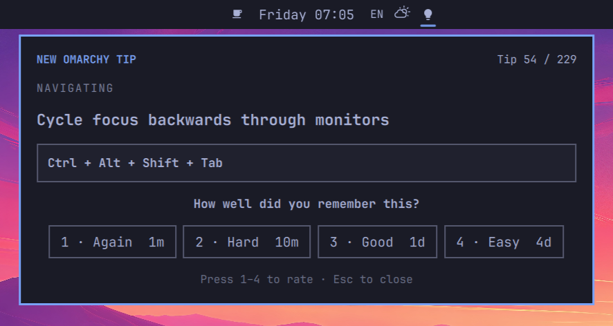

# OmaTips

Master Omarchy keyboard shortcuts with native notifications and Anki-style
spaced repetition.

OmaTips is an Omarchy 4 shell plugin with 229 concise tips based on
the official [Omarchy hotkeys manual](https://omarchy.org/manual/hotkeys/).
The course covers desktop navigation, window management, applications,
capture tools, Tmux, Ghostty, the file manager, Neovim, quick emojis, and
XCompose completions.

Rather than presenting a long cheat sheet, OmaTips introduces shortcuts one at
a time and brings them back for review until they become muscle memory.



## Install

Install and enable OmaTips from GitHub:

```sh
omarchy plugin add https://github.com/yarikov/omatips --enable
```

Plugins run as unsandboxed code inside `omarchy-shell`; review third-party
plugin code before enabling it.

## Use

- Click the lightbulb in the bar to open the current card.
- Grade it with `1` Again, `2` Hard, `3` Good, or `4` Easy.
- Press Escape to close the panel.
- Click the notification itself (or its **Study now** action) to open the same panel.

Due reviews always come before unseen cards. When no review is due, the next
new shortcut is available immediately—there is no calendar-day study gate.
The bar count includes only studied cards whose review time has arrived; an
available new card is shown as a lightbulb without a number.

OmaTips treats 04:00 as the start of a new local study day. Each study day runs
from 04:00 through 03:59 the following calendar day. If the queue is not empty,
OmaTips may send one reminder between 08:00 and 16:00. It waits for the session
to be active and unlocked, but never sends a late reminder after 16:00. For
example, if you first start the computer at 17:00, no reminder is sent that day.

Opening the study panel at any time marks the current study day as visited and
cancels its reminder. You can still open the panel manually and introduce any
number of new cards through the lightbulb. The notification itself is a short
study reminder and does not reveal the next card.

## Scheduling

Each rating button previews the actual interval that will be assigned to the
current card. New cards begin with:

| Rating | Initial interval | Later behavior |
| --- | ---: | --- |
| **Again** | `1m` | Resets the successful-review streak and lowers ease |
| **Hard** | `10m` | Multiplies the current interval by `1.2` and lowers ease |
| **Good** | `1d` | Multiplies the current interval by the card's ease factor |
| **Easy** | `4d` | Multiplies by ease and an additional `1.3` bonus |

Ease starts at `2.5`. Successful reviews make intervals grow from the card's
current interval, while difficult or forgotten cards grow more slowly or
return to the initial steps.

Choosing **Easy** three reviews in a row completes the card permanently, so it
no longer appears in the study queue. Any other rating resets this streak.

Button labels stay compact as intervals grow: `m` is minutes, `h` is hours,
`d` is days, `mo` is 30-day months, and `y` is 365-day years. A trailing `+`
means the exact interval contains a smaller remainder—for example, `27d+`
may represent 27 days and several additional hours.

When every introduced card is scheduled for later, OmaTips stays out of sight
until the next review becomes due.

## Privacy and safety

The hotkey course is instructional data: studying a card does not execute its
shortcut or modify your bindings. OmaTips does not use the network, request
privileges, collect telemetry, or edit system configuration.

Course state is stored at:

```text
${XDG_STATE_HOME:-~/.local/state}/omarchy/omatips/state.json
```

The file is replaced atomically after each state update. Missing state starts a
new course. Invalid, unsafe, or larger-than-1-MiB state is left untouched;
OmaTips disables study-state updates and reports the error in the shell log so
the file can be inspected safely.

## Develop and verify

From the repository root:

```sh
omarchy plugin validate .
qmllint -I /usr/share/omarchy/shell Service.qml BarWidget.qml Panel.qml
QT_QPA_PLATFORM=offscreen QT_QPA_PLATFORMTHEME= /usr/lib/qt6/bin/qmltestrunner -input tests
bash tests/validate_content.sh
bash tests/test_state_read.sh
```

Changes under `~/.config/omarchy/plugins/` hot-reload. If needed, request a
manual rescan with `omarchy-shell shell rescanPlugins`.

## Remove

```sh
omarchy plugin remove yarikov.omatips --yes
rm -f "${XDG_STATE_HOME:-$HOME/.local/state}/omarchy/omatips/state.json"
```

The first command removes the plugin. The second deletes all saved study
progress; omit it if you want a future reinstall to resume the schedule.

## License

MIT
